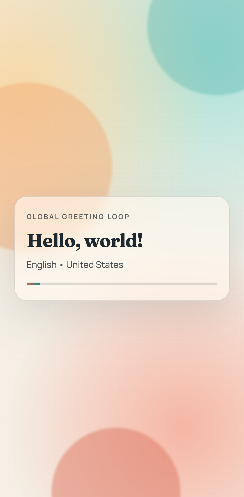

# Hello World Aesthetic

An aesthetic, animated "Hello, world!" web app that rotates through greetings in multiple languages.

Live page: https://bitnovus.github.io/hello-world-aesthetic/

## Screenshots

### Desktop


### Mobile



## Local Run

```bash
python3 -m http.server 8000
```

Then open `http://localhost:8000`.
